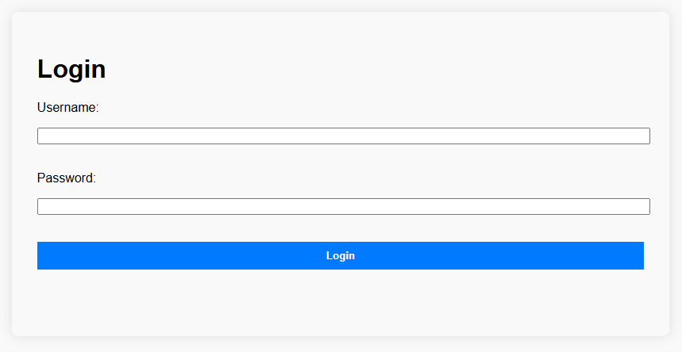
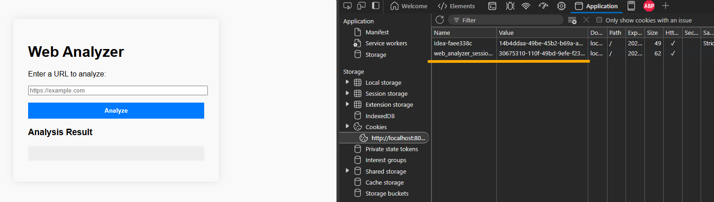

# web-analyzer

This is a web app used to analyze the content of a webpage.
It reads a webpage content and extracts the following information.

1. HTML version
2. Page title
3. Number of headings
4. Number of internal and external links
5. Count of the inaccessible links
6. List of the inaccessible links
7. Checks whether the page contains a login form

The app is built using GoLang.

## Prerequisites

- Go 1.24.3 or later
- Latest version of the Google Chrome (make sure the path to Chrome is added to the path in environment variables)

---

## External dependencies

- chromedp: For rendering and fetching webpage content. `github.com/chromedp/chromedp`
- goquery: For parsing and querying HTML documents. `github.com/PuerkitoBio/goquery`
- logger: For structured logging. `github.com/sirupsen/logrus`

---

## Setup

The default server port is 8080. You can change it by modifying the `server_port` of the `config.json`.

* ### Using GO

    * #### Clone the repository:

      `git clone https://github.com/kasundm5566/web-analyzer.git`

      `cd web-analyzer`

    * #### Install Go dependencies:

      `go mod tidy`

    * #### Run the application:

      `go run ./cmd/webanalyzer/main.go`

      Access the web interface at http://localhost:8080

* ### Using the Makefile

    * #### Clone the repository:

      `git clone https://github.com/kasundm5566/web-analyzer.git`

      `cd web-analyzer`

    * #### Build the application

      `make build`

    * #### Run the application

      `make run`

      Access the web interface at http://localhost:8080

---

## Sample cURL of the endpoint to analyze a webpage

`curl --location 'localhost:8080/analyze-url' \
--header 'Content-Type: application/json' \
--data '{
    "url": "https://maze.co/guides/content-testing/"
}'`

Sample response:

```json
{
  "htmlVersion": "HTML5",
  "pageTitle": "Content Testing For UX: From Copy to Conversion | Maze",
  "numberOfHeadings": 28,
  "numberOfInternalLinks": 39,
  "numberOfExternalLinks": 8,
  "numberOfInaccessibleLinks": 2,
  "inaccessibleLinks": [
    "https://www.linkedin.com/in/kate-varga-65aa0918b/",
    "https://www.linkedin.com/in/vaidapakulyte/"
  ],
  "containsLoginForm": false
}
```

## Sample cURL for the login request

`curl --location 'localhost:8080/login' \
--header 'Content-Type: application/json' \
--data '{
    "username": "user",
    "password": "password"
}'`

```json
{
  "status": "success"
}
```

---

## Login



Please use the following credentials to login to the application.
Once logged in, a session will be created and will be expired after an hour.

```text
username: user
password: password
```



---

## Limitations

- The application relies on Google Chrome for rendering webpages, which may increase resource usage.
- The analysis of inaccessible links is limited to a HEAD request with a short timeout, which may not work for all
  servers.
- The detection of the HTML version is based on the DOCTYPE string and may not be accurate for non-standard pages.
- The results may not be accurate for complex webpages with dynamic content or heavy JavaScript usage or iframes.
- The application is only tested on Windows. It may need some modifications to run on other operating systems.

---

## Challenges faced

- Getting use to the GoLang syntax and libraries.
- Finding a better library to extract the webpage content.
- Implementation of wait groups.

---

## Possible improvements

- Implement a more robust method for checking link accessibility.
- Implement a more user-friendly interface.
- Implement a caching mechanism to store results for previously analyzed page results.
- Add support for analyzing multiple pages in parallel.
- Implement a more sophisticated method for detecting login forms.
- Add support for analyzing other types of content (e.g., images, videos, etc.).
- Add authentication mechanism to the endpoint.
- For the login, currently it is using an in-memory database. It can be improved by using a proper database.

---

## Demo

https://1drv.ms/v/c/b4cceae27e0e7904/EcPK44xmIKRKh088yt0jb8wByOPa0mSxskoMTQ0I3zsa_w?e=ndQKBX